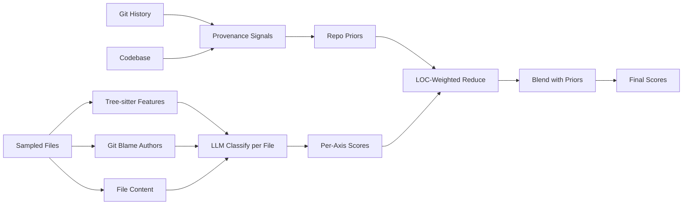

# contrib-estimator

Estimate codebase contribution sources as a 5-axis radar chart:

```json
{"author": 80, "ai": 40, "team": 90, "research": 55, "unspecified": 30}
```

Axes are **independent 0-100 scores** (not a percentage split).

## Axes

| Axis | Signal |
|---|---|
| `author` | Single human contributor — consistent style, organic naming, micro-edits |
| `ai` | LLM-generated — boilerplate verbosity, defensive try/except, polished docstrings, AI co-author footers |
| `team` | Multi-contributor — many distinct human authors, merge commits, divergent style zones |
| `research` | External copy — SO/MDN patterns, tutorial scaffolds, library boilerplate |
| `unspecified` | Generated / vendored / unknown provenance |

## Install

```bash
pip install -e .
```

## Env

```bash
cp .env.example .env  # or set vars directly
LITELLM_BASE_URL=...
LITELLM_KEY=...
MODEL_CLASSIFY=openai/kimi-k2.5     # default; needs openai/ prefix on LiteLLM gateway
```

Optional guards: `MAX_CHUNKS=200`, `MAX_FILE_KB=100`, `MAX_TOKENS_BUDGET=500000`, `SEED=42`.

## Usage

```bash
contrib-estimator --repo /path/to/repo                          # whole repo
contrib-estimator --scope commit --ref abc123                   # one commit
contrib-estimator --scope mr --base main --head feature-x       # MR / PR
contrib-estimator --verbose                                     # incl. metadata + provenance
```

## Docker

```bash
docker build -t contrib-estimator .
docker run --rm -v "$PWD:/repo" \
  -e LITELLM_BASE_URL=... -e LITELLM_KEY=... \
  contrib-estimator --scope mr --base main --head feature-x --verbose
```

## Methodology

The pipeline is a **multi-signal fusion**: deterministic git/code signals + per-file LLM classification, blended convexly per axis.



### Deterministic provenance signals (`collect/provenance.py`)

Research backing:

| Signal | What it measures | Source |
|---|---|---|
| `ai_footer_rate` | % commits with `Co-Authored-By: Claude/Cursor/Copilot/Codex/...` | direct admission |
| `agentic_author_rate` | % commits authored by names matching `Agent`, `Bot`, `Copilot`, etc. | direct admission |
| `conventional_rate` | % commits matching `feat(scope):` / `fix:` / ... | [Fingerprinting AI Coding Agents](https://arxiv.org/abs/2601.17406) — automation discriminator |
| `msg_uniformity` | top-5 normalized commit subjects' share | same — agentic loops produce repetitive bodies |
| `burstiness` | % inter-commit gaps ≤60s | tight auto-commit loops are an agent signature |
| `peak_commits_per_day` | max commits any single day | AI velocity |
| `todo_per_kloc` | TODO/FIXME/XXX per 1k LOC | ["Debt Behind the AI Boom"](https://arxiv.org/abs/2603.28592) — humans leave debt |
| `doc_to_code_ratio` | markdown LOC / code LOC | AI workflows over-document |
| `has_ai_workflow` | presence of `CLAUDE.md` / `.cursorrules` / `AGENTS.md` / etc. | explicit workflow declaration |

These signals are computed once per run (~1-2s) and:
1. Injected as a string into the per-file LLM prompt as a **repo-level prior**.
2. Combined into `ai_prior`, `author_prior`, `team_prior` (0-100 each) used for post-classification blending.

### Convex blend (`blend.py`)

```python
final_axis = (1 - w_prior) * llm_score + w_prior * prior_score
```

Per-axis prior weights (rationale: direct git evidence dominates surface code style):

| Axis | `w_prior` | Why |
|---|---:|---|
| `ai` | 0.5 | very strong deterministic signals (footers + agentic authors) |
| `team` | 0.4 | distinct-human-author count is reliable, dampened by AI dominance |
| `author` | 0.3 | weaker — single-author signal hard to ground |
| `research` | 0.0 | no deterministic prior — LLM-only |
| `unspecified` | 0.0 | LLM-only |

The fusion approach is grounded in [TriFusion-LLM (2026)](https://arxiv.org/abs/2603.15004) and [SemEval-2026 Task 13](https://arxiv.org/abs/2605.01596), both of which show even simple multi-signal fusion outperforms any single-signal classifier by 5-10 pp F1.

### LLM-as-judge bias mitigation

The system prompt (`classify/prompts.py`) carries explicit warnings derived from ["Bias in the Loop: Auditing LLM-as-a-Judge for Software Engineering"](https://arxiv.org/abs/2604.16790):

1. **Verbosity bias** — well-structured human code is mistaken for AI. Counter: weight metadata over surface polish.
2. **Metadata weight** — explicit AI author identities and `Co-Authored-By:` footers are direct evidence; weight heavily.
3. **No hedging** — refuse to park scores in `unspecified` to dodge commitment.
4. **Repo priors** — blend deterministic priors with file-level evidence.

### Sampling

Files > `MAX_CHUNKS` (default 200) are reduced via stratified weighted sampling: top-level dir = stratum, weight = 90-day churn. Reproducible via `--seed`.

### Languages

v1: Python, TypeScript / JavaScript / TSX / JSX, Java. Other languages skipped during file collection (still counted in provenance signals).

## Accuracy ceiling

Current state-of-the-art for binary human-vs-AI code detection sits at **~80-87% F1 in-distribution**, dropping to **~65-74% cross-generator / in-the-wild** ([AICD Bench, 2026](https://arxiv.org/abs/2602.02079); [SemEval-2026 Task 13](https://arxiv.org/abs/2605.01596)). **Hybrid code** (AI-written then human-edited) is **effectively unsolved**. Treat the radar chart as a calibrated guess, not a forensic verdict.

For attribution to specific AI agents (Copilot / Devin / Claude / Cursor), [Fingerprinting AI Coding Agents on GitHub](https://arxiv.org/abs/2601.17406) shows commit-message conventions are *more* discriminative than code changes — which is why our agent weights metadata heavily.

## Benchmark

`tests/golden/govtool_benchmark.json` holds a snapshot run on a real Italian-language codebase with mixed human + AI authorship. The provenance signals are asserted reproducibly in `tests/test_golden.py` (skipped if the source repo isn't present).

Example output (25-chunk sample, govtool):
```json
{"author": 29, "ai": 70, "team": 39, "research": 5, "unspecified": 1}
```

Repo-truth at capture time:
- 38% commits with `Co-Authored-By: Claude` footer
- 46% commits authored by AI-named identities (`Riccardo Agentic`, `RiccardoAgent`)
- 1 TODO marker in 45 000 LOC
- 18% of inter-commit gaps ≤ 60 seconds
- 108 commits on peak day

## Tests

```bash
pytest -q
```

21 tests covering provenance regexes, burstiness/uniformity formulas, sampling, aggregation, schema, and golden reproducibility.
